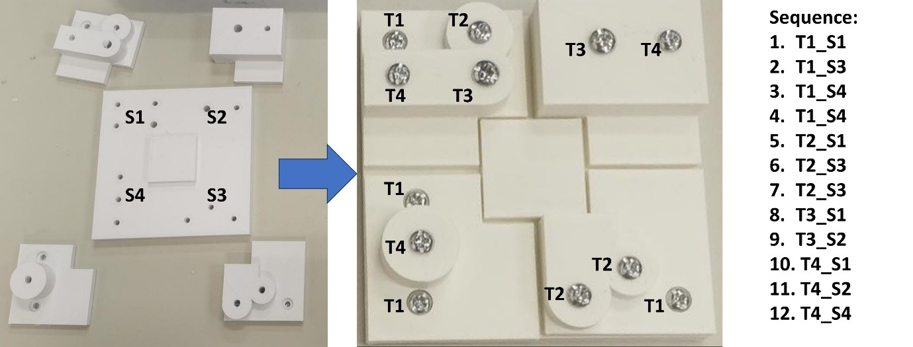

# HCRSortingScrews

The system architecture encompasses two main modules connected through TCP/IP protocol: the controller (main.py) and the server (matlabServerEquiNet.m). The controller sends G-codes to the server to move the robot, which follows line trajectories in the cartesian space. Additionally, it controls the magnet tool, which is an Arduino UNO with the firmware.ino script loaded in it. The controller also supports a RealSense camera attached to a 2-finger robotniq gripper. The server receives G-codes from the controller and utilizes the Kuka Sunrise toolbox package to establish a connection with the KUKA robot. Hence, it is necessary to download the package from: [https://github.com/Modi1987/KST-Kuka-Sunrise-Toolbox.git](https://github.com/Modi1987/KST-Kuka-Sunrise-Toolbox.git). 

## Human-robot collaboration assembly

The task intended to perform is comprised of a 5-piece part and 12 screws of different sizes. The screws are divided into four categories: T1, T2, T3, and T4. On the other hand, there is a tray where the robot deposits the screws depending on the step of the assembly task, this is S1, S2, S3, and S4.  To this end, the sorting order of the screws is the following:

For a better understanding of the task, please see: 

## Installation 

The system was tested on a Laptop, Acer AN585-58, with Windows 11:

• **Processor:** 12th Gen Intel(R) Core(TM) i5-12500H   3.10 GHz

• **Installed RAM:** 16.0 GB (15.7 GB usable)

• **System type:** 64-bit operating system, x64-based processor

The following is required:

• Install Python 3.9 

• pip install pyrealsense2

• pip install flask

• pip install requests

• pip install minimalmodbus

• pip install opencv-python

• Install **MATLAB2022b** (If installing newer versions, the Kuka Sunrise toolbox package does not connect with the robot).

• Get the Kuka Sunrise toolbox package from: [https://github.com/Modi1987/KST-Kuka-Sunrise-Toolbox.git](https://github.com/Modi1987/KST-Kuka-Sunrise-Toolbox.git).

• Set a fixed IP address for your laptop as follows:

## State API

The State API oversees monitoring the state of the task. The stateAPI.py is a RESTFUL API that runs the Flask python library. This API aims to solve the high latency issue we had with our previous work. In this way, the access to the information is faster and smoother. To launch the script, open a PowerShell terminal, navigate to the folder using cd, and type the following:

python stateAPI.py

## How to read the state from Python?

When starting the task, the state is always ‘OFF.’ Once the robot starts sorting the screws, the state will change to T1_S2, T1_S4 etc. To launch the script, open a new tab from PowerShell and type:

python reading_state_example.py 

## How to read the state from C#?

I added a C# script to help you with your experiments with the AR device. As you can see, it is also possible to get information from the stateAPI:

## How to access the API from a different device?

While the example C# script that reads the state run in the same machine with IP_ADDRESS_SERVER= http://127.0.0.1:5000, it is necessary first to connect everything to a common router and run ipconfig to find the right IP address of the API server.

## How to set the state?

During the task, main.py controls the movements of the robot. However, for testing purposes, the set_state_example.py script publishes fake states to the state API such that it is possible to access the API with the reading_state_example.py or reading_state_example_c_sharp.cs if using Python or C#, respectively. You can simply run this script to test the AR device without the robot, such that you can develop the software you need according to your necessities. For launching the set_state_example.py, open a new tab in PowerShell and type:

python set_state_example.py

## How to launch the MATLAB TCP/IP server?

After downloading the Kuka Sunrise package from: https://github.com/Modi1987/KST-Kuka-Sunrise-Toolbox.git, please unzip somewhere in your PC and copy and paste the matlabServerEquiNEt.m and EquiNetKuka.m scripts to …\MATLAB_kuka\Matlab_client\ and open both from MATLAB:

Then, remember that the folder temp and the file inside called temp.txt is utilized by the server and the controller as a flag that notifies python when the robot executed the instruction. Hence, if the PATH is not properly configured, the system will not work:

If for some reason the main.py freezes or breaks, just type the following instructions in MATLAB:

1.	Ctrl+c

2.	robot.disconnect_robot()

3.	clear all

In case of not executing the previous instructions, the app running in the kuka robot will stall and it will be necessary to restart the robot. However, if the app still does not stop or the robot stops moving, restarting the robot will be necessary anyway. 

For changing the velocity of the robot just modify the linearVel variable:

 Nevertheless, I don’t recommend you increasing the velocity as it may be dangerous.

## How to launch main.py

The main.py script can be launch from the PowerShell or from any IDE, the following example is with Spyder (please make sure that the tool and the RealSense camera are connected to your computer):

Finally, remember that if main.py freezes you must restart the kernel every time to avoid errors such as “device COM4 is already in use” This is because the last execution of main.py didn’t close the Arduino PORT and provoked this problem, so in order to avoid any issue, just restart the kernel or Ctrl+c in PowerShell, if that still doesn’t work, open press Ctrl+Alt+Del and search for Python in the Task manager and kill all the python related processes. In Spyder, you can restart the kernel by clicking on the X of the terminal tab or by selecting restart Kernel from the menu on the right side:

## General advice

<mark style="background-color: yellow">Please try to run only the matlabServerEquiNet.m, main.py, and the stateAPI.py scripts on your computer and **nothing else**.</mark> This is because the RealSense stream is running in a thread, and in case of running extra software on your computer, this may provoke the Camera to freeze, and the system will not perform properly.

<mark style="background-color: yellow">Please only use the MATLAB2022b version, newer versions proved to have many issues when trying to establish communication with the Kuka robot.

<mark style="background-color: yellow">Use a good quality Ethernet Cable. Using an Ethernet cable in bad shape may provoke some connection problems, and **the robot may perform sudden aggressive movements**. 

<mark style="background-color: yellow">Please make sure that the laptop’s screen does not turn off after some minutes.</mark> This is because if the screen turns off, the RealSense Camera will be disconnected, and consequently, the robot will start to make chaotic movements, and the robot won’t be able to complete the task.

